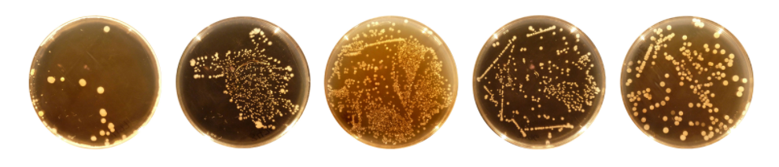

# Plotly-deploy

*A JavaScript and Plotly.js interactive dashboard*

## Overview of Project
## Purpose

For this project I am creating an **interactive dashboard**, a creative visualization that enables communication by offering interactivity which can help the audience better understand the data and draw the same conclusions as researchers and data analysts. 
The purpose of this research is to **gather, identify and analyze biological footprint of individuals’ navels**. 

The research holds data of 153 individuals and their: 
  -	Unique and anonyms ID.
  -	Demographic information.
  -	Belly button scrubbing frequency.
  -	Belly button biological footprint.
  

## Background 
Identify bacterial species that have the **ability to synthesize proteins that taste like beef** (so far laboratories had success in synthesizing meat from algae, fungi and microorganisms found on plat roots) and there is a good chance to find the right bacteria species on human bodies as well (1).

Moreover, scientists could use those new samples to start testing the **correlation of the navel dwellers** with everything from subjects' places of birth to the **makeups of their immune systems**. Making such connections could help discover the **ties between bacterial hosts and their effects on individual’s health**. Researchers believe that **microbes are involved in everything from immune function to acne to skin softness**. The potential boon to medicine is enormous, so let the exploration begin (2).

The individual can find one’s information by **selecting unique ID from a drop-down menu** and explore data by deep dive in their own results and also compare to other individuals. **This research is public and easily accessible**, so anyone can learn more about bellybutton biodiversity and explore this fascinating field. The interactive dashboard can be found in the link that follows:
 
 

:microbe: <b>Belly Button Biodiversity Dashboard:</b> https://andrejach.github.io/plotly_deploy/ :microbe:

 

## Resources 
Advantage of **JavaScript** and **Plotly.js** library is that the audience doesn’t have to have any additional programs installed on their computers in order to *“run the code”*. JavaScript enables to create visualizations that are attractive, accessible and interactive.
For this project I used:

-	The data, stored in a json file. [samples.json]( samples.json).
-	The table is built by inserting **JavaScript** and **Plotly** into HTML page. [charts.js](charts.js).
-	**HTML** to build the webpage [index.html](index.html).
-	**CSS** and **Bootstrap** to style the page [style.css](css/style.css)
-	**Chrome Developer Tools** to test the code.
-	**GitHub** to deploy and showcase the final results [Belly Button Biodiversity Dashboard](https://andrejach.github.io/plotly_deploy/).

## References
- (1)	Module 12: Tools for Scraping. https://courses.bootcampspot.com/courses/200/pages/12-dot-0-3-tools-for-scraping?module_item_id=84244, Web 10 Oct 2020.
- (2)	Shannon Fischer. “What Lives in Your Belly Button? Study Finds "Rain Forest" of Species” *The National Geographic.* 14 Nov, 2012. [Web]( https://www.nationalgeographic.com/news/2012/11/121114-belly-button-bacteria-science-health-dunn/). 3 Oct 2020.

